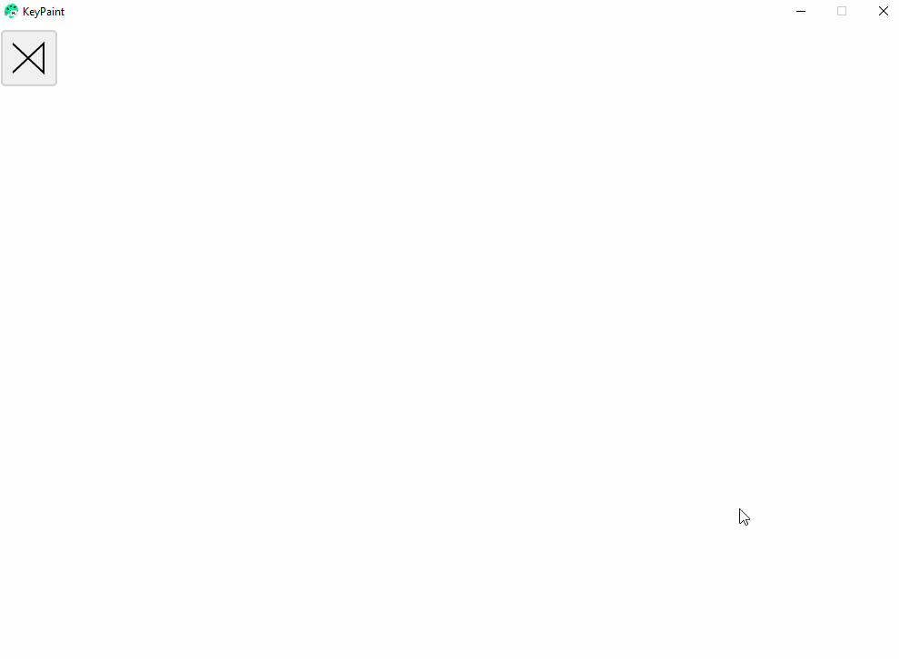

> Cursors and mice are strictly forbidden!

# KeyPaint

KeyPaint is a desktop drawing application enabling anyone to draw using only a keyboard.

 

## What can you draw?
**Can do**: filled paths, outline, rounded corners, 4 shades of gray + black, line width, line fuzzyness.

**Can't do**: Fine splines, gradients.

  

**Cube Demo**

  

## Controls guide

   

## Important mentions

**Huge thanks to these incredible people maintaining the libraries that made this possible:**

[Silk.NET](https://github.com/dotnet/Silk.NET) - high-speed .NET multimedia, graphics, and compute; providing bindings to popular low-level APIs such as OpenGL, OpenCL, OpenAL, OpenXR, GLFW, SDL, Vulkan, Assimp, WebGPU, and DirectX.

[SkiaSharp](https://github.com/mono/SkiaSharp) - Cross-platform 2D graphics API for .NET platforms based on Google's Skia Graphics Library (skia.org)

   

# Licence
## KeyPaint 
A 100% keyboard drawing application. 
Copyright (C) 2023 Cosmin Crețu

This program is free software: you can redistribute it and/or modify 
it under the terms of the GNU General Public License as published by 
the Free Software Foundation, either version 3 of the License, or 
(at your option) any later version. 
 
This program is distributed in the hope that it will be useful, 
but WITHOUT ANY WARRANTY; without even the implied warranty of 
MERCHANTABILITY or FITNESS FOR A PARTICULAR PURPOSE.  See the 
GNU General Public License for more details. 

You should have received a copy of the GNU General Public License 
along with this program.  If not, see <http://www.gnu.org/licenses/>.