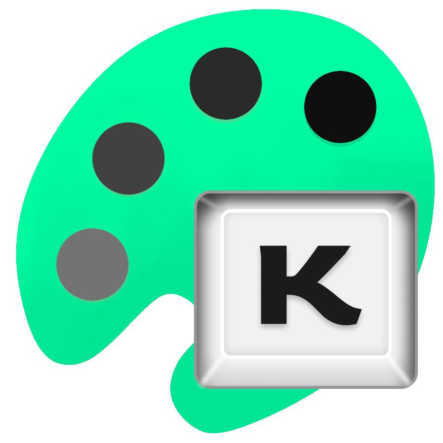

> Cursors and mice are strictly forbidden!

# KeyPaint

KeyPaint is a desktop drawing application enabling anyone to draw using only a keyboard. 

## What can you draw?
Pretty much anything you can imagine, KeyPaint allows paths filled or not, rounded corners, 4 shades of gray + black, line width, line fuzzyness.

